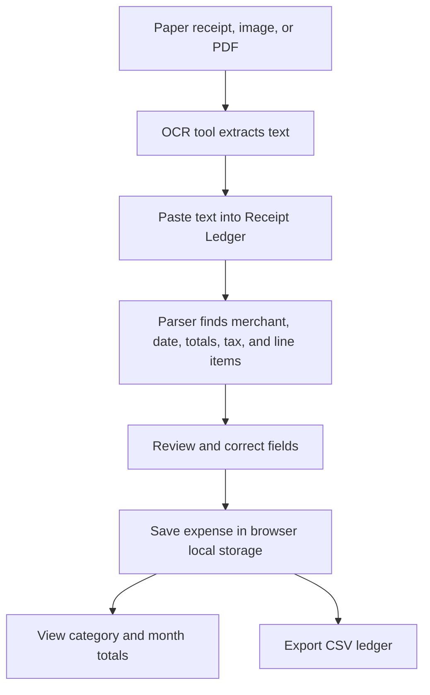

# Receipt Ledger

Receipt Ledger is a local-first receipt reader and expense tracker for turning OCR text or pasted receipt text into a clean spending ledger. It extracts receipt fields, lets you correct the results, stores expenses in the browser, summarizes spending, and exports CSV for accounting tools.

## Who It Is For

- Freelancers who need a lightweight receipt log for tax deductions, project expenses, reimbursements, and quarterly review.
- Small-business owners who want to capture ad hoc purchases, supplies, travel, meals, and utility receipts without a full accounting platform.
- Bookkeepers and finance operators who need a quick triage workspace for cleaning OCR output before importing rows into spreadsheets or accounting systems.
- Anyone who wants receipt tracking that stays on their machine instead of sending receipt contents to a hosted service.

## Real-World Use Cases

- Convert mobile scanner or PDF OCR output into structured merchant, date, total, tax, category, notes, and line-item data.
- Review a month of small expenses by category before client invoicing, tax filing, or reimbursement.
- Keep a simple browser-based ledger for office supplies, transport, meals, software, health, utilities, and travel receipts.
- Export a CSV ledger that can be imported into spreadsheets, shared with an accountant, or attached to a finance workflow.

## How The Flow Works

Receipt Ledger does not upload images or run cloud OCR. Use your scanner, phone, operating system, PDF tool, or another OCR tool to extract text from a receipt, then paste that text into the app. The parser looks for common receipt patterns such as merchant names, dates, subtotal, tax/VAT/GST, total/amount due labels, and trailing line-item amounts. You then review the parsed values, correct any fields, assign a category, save the expense, and export the ledger when needed.



## Features

- Paste OCR or receipt text and parse merchant, date, total, tax, subtotal, and line items.
- Correct parsed fields before saving.
- Assign categories and add notes for finance context.
- Edit or delete saved expenses.
- View totals by category and calendar month.
- Persist data in browser local storage.
- Export the ledger as CSV.

## Setup

Requirements:

- Node.js 24.x is used by CI.
- npm with lockfile installs via `npm ci`.

Install and run locally:

```bash
npm ci
npm run dev
```

Then open the local Vite URL printed by the dev server.

## Environment Configuration

No environment variables are required for the current app. The tracked `.env.example` documents the safe pattern for future configuration:

- Copy `.env.example` to `.env.local` only when adding local config.
- Keep real `.env`, `.env.local`, and other `.env.*` files out of git.
- Treat every `VITE_` value as public because Vite exposes it in the browser bundle.
- Never store OCR credentials, API keys, bank details, client data, or receipt contents in env files.

## Commands

```bash
npm run dev      # Start the Vite development server
npm run lint     # Run ESLint
npm test         # Run Vitest once
npm run build    # Type-check and build the production bundle
npm audit --audit-level=moderate
npm outdated
```

## Codebase Structure

```text
.
|-- .github/
|   |-- dependabot.yml
|   `-- workflows/ci.yml
|-- src/
|   |-- App.tsx
|   |-- main.tsx
|   |-- styles.css
|   `-- lib/
|       |-- expenseAnalytics.ts
|       |-- expenseStore.ts
|       |-- receiptParser.ts
|       `-- types.ts
|-- .env.example
|-- package.json
|-- package-lock.json
|-- tsconfig*.json
`-- vite.config.ts
```

Key modules:

- `src/lib/receiptParser.ts` normalizes receipt text and extracts dates, totals, tax labels, and line items.
- `src/lib/expenseAnalytics.ts` normalizes saved expenses, builds category/month totals, and exports CSV.
- `src/lib/expenseStore.ts` saves and loads the local ledger from browser storage.
- `src/App.tsx` contains the receipt parser UI, correction form, summaries, ledger table, and CSV export action.

## Privacy And Security Notes

- Receipt data stays in the browser's local storage for the current device and browser profile.
- The app has no backend, database, analytics SDK, or built-in network upload path for receipt contents.
- Clearing site data, switching browsers, or using private browsing can remove saved ledger entries.
- Exported CSV files may contain merchant names, dates, notes, item names, tax, and totals. Store and share exports as financial records.
- Do not paste secrets, card numbers, full account numbers, health details, or client-sensitive information unless you are comfortable storing that text locally in the browser.
- If future OCR APIs or sync features are added, document the provider, retention behavior, access controls, and required env variables before enabling them.

## Dependency Maintenance

- GitHub Actions runs install, audit, outdated, lint, tests, and build on pushes to `main` and pull requests.
- Dependabot is configured for npm packages and GitHub Actions.
- `npm audit --audit-level=moderate` is the vulnerability gate.
- `npm outdated` is the freshness gate for direct dependencies.
