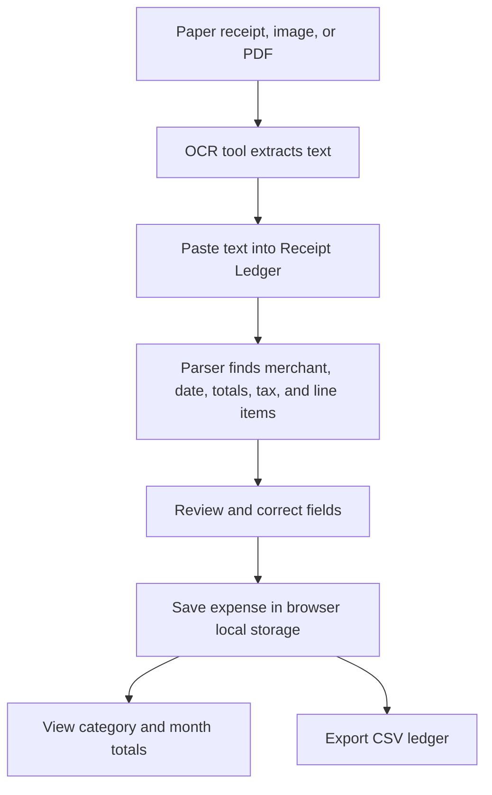

# Architecture

Receipt Ledger is a single page React app built with Vite. It has no backend. All parsing, storage and export run in the browser.

## Flow

Receipt Ledger does not upload images or run cloud OCR. Use your scanner, phone, operating system, PDF tool, or another OCR tool to extract text from a receipt, then paste that text into the app. The parser looks for common receipt patterns such as merchant names, dates, subtotal, tax/VAT/GST, total and amount due labels, and trailing line item amounts. You then review the parsed values, correct any fields, assign a category, save the expense, and export the ledger when needed.

The diagram source is [architecture.mmd](architecture.mmd).

## Key modules

- `src/lib/receiptParser.ts` normalizes receipt text and extracts dates, totals, tax labels, and line items.
- `src/lib/expenseAnalytics.ts` normalizes saved expenses, builds category and month totals, and exports CSV.
- `src/lib/expenseStore.ts` saves and loads the local ledger from browser storage.
- `src/lib/types.ts` holds the shared types.
- `src/App.tsx` contains the receipt parser UI, correction form, summaries, ledger table, and CSV export action.

## Other tracked files

- `.github/workflows/ci.yml` and `.github/dependabot.yml`: CI and dependency updates, see [maintenance.md](maintenance.md).
- `.env.example`: configuration template, see [configuration.md](configuration.md).
- `tsconfig.json`, `tsconfig.app.json`, `tsconfig.node.json`, `vite.config.ts`, `eslint.config.js`: build, type check and lint configuration.
